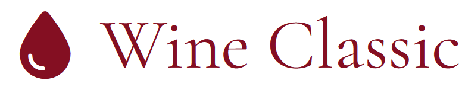

# Wine Classic




Apenas uma Landing Page para exibir informações a respeito de uma marca de vinhos. 


## 👨‍🏫 Demostração do site.


- [x] Full Responsive.
- [x] Mobile First.

## 🔨 Tecnologias Utilizadas.
 
 1. Jquery
 2. Css
 3. Html

 ## 🌐 Acessar o projeto.
### [Wine Classic](https://felipedev-portfolio.vercel.app/projetos/wineclassic/index.html)

## 👨‍💻 Como Executar o Projeto no seu Computador.

### Passo a passo
Clone o Repositório
```sh
git clone git@github.com:FelipeDevFull/wineclassic.git
```
Click no arquivo "index.html" dentro da pasta "wineclassic".
